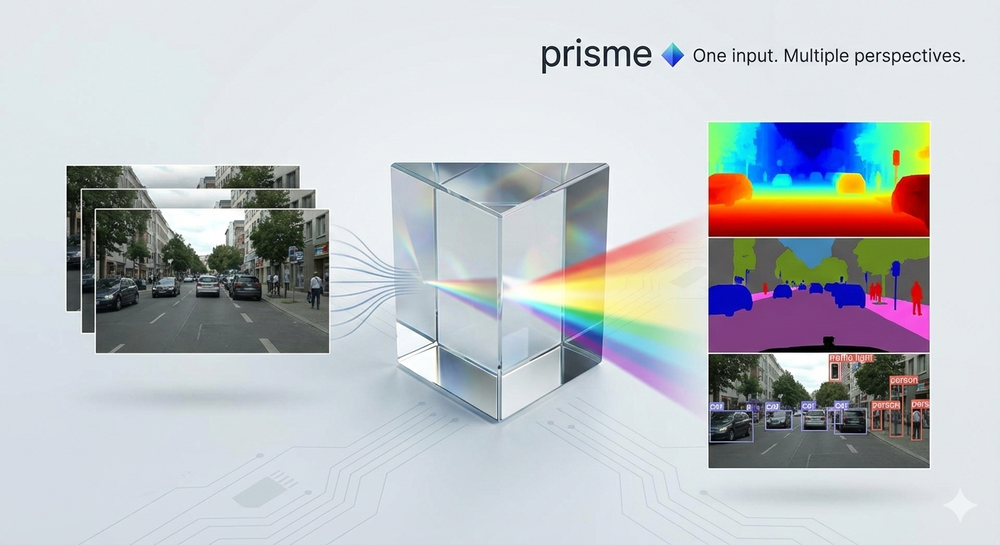

# 🌈 prisme

> **One input. Multiple perspectives.**  
> Unified computer vision inference for research & visualisation.

[](LICENSE)
[](https://www.python.org/)
[](https://pytorch.org/)
[](https://github.com/psf/black)
[](http://mypy-lang.org/)
[](https://github.com/yourusername/prisme/issues)



**prisme** lets you feed an image or video, configure multiple CV tasks in a single YAML file, and get a tiled output with all results side-by-side — no manual pipeline stitching.

Built for autonomous driving scene understanding, but equally powerful for any outdoor/urban scene analysis.

---

## Table of Contents

- [Demo](#demo)
- [Installation](#installation)
- [Usage](#usage)
- [Supported Tasks](#supported-tasks)
- [Output Grid Layout](#output-grid-layout)
- [Adding a New Task](#adding-a-new-task)
- [Requirements](#requirements)
- [License](#license)

---

## Demo

<!-- Replace with actual hosted video/GIF -->


> 💡 *Tip: For best results, use 1280px width inputs. All models auto-resize if configured.*

---

## Installation

```bash
git clone https://github.com/dronefreak/prisme.git
cd prisme
python -m venv .venv
source .venv/bin/activate
pip install -e .
```

## Usage

Edit `configs/example.yaml`:

```yaml
input: /path/to/your/video.mp4
output: /path/to/output.mp4
tile_width: 640
tile_height: 480

tasks:
  - name: surface_normals
    resize_before_inference: 1280

  - name: object_detection
    threshold: 0.4
    resize_before_inference: 1280

  - name: semantic_segmentation
    segformer_model: b2
    resize_before_inference: 1280

  - name: depth_estimation
    model_size: large
    resize_before_inference: 1280

  - name: panoptic_segmentation

  - name: hybridnets
    road_alpha: 0.4
    lane_alpha: 0.6

  - name: pose_estimation
    det_conf: 0.3
    kp_conf: 0.3
```

Then run:

```bash
prisme input=/path/to/video.mp4 output=/path/to/output.mp4
```

Any config value can be overridden inline via Hydra.

---

## Supported Tasks

| Task | Model | Source |
|------|-------|--------|
| Surface Normals | [DSINE](https://github.com/hugoycj/DSINE-hub) | `torch.hub` |
| Object Detection | [RF-DETR Base](https://github.com/roboflow/rf-detr) | `pip install rfdetr` |
| Semantic Segmentation | [SegFormer-B2](https://huggingface.co/nvidia/segformer-b2-finetuned-cityscapes-1024-1024) — Cityscapes | HuggingFace |
| Depth Estimation | [Depth Anything V2 Large](https://huggingface.co/depth-anything/Depth-Anything-V2-Large-hf) | HuggingFace |
| Panoptic Segmentation | [Mask2Former](https://huggingface.co/facebook/mask2former-swin-large-cityscapes-panoptic) — Cityscapes | HuggingFace |
| Drivable Area + Lanes | [HybridNets](https://github.com/datvuthanh/HybridNets) — BDD100K | `torch.hub` |
| Pose Estimation | [ViTPose-B](https://huggingface.co/usyd-community/vitpose-base-simple) + YOLOv8n detector | HuggingFace + `ultralytics` |

All models are inference-only. No training code.

---

## Output Grid Layout

The original frame always occupies slot 0. Tasks fill the remaining slots in config order.

| Tasks | Grid |
|-------|------|
| 1 | 1×2 |
| 2 | 1×3 |
| 3 | 2×2 |
| 4 | 2×3 |
| 5 | 2×3 |
| 6 | 2×4 |
| 7 | 2×4 |

---

## Adding a New Task

1. Create `src/prisme/tasks/your_task.py` subclassing `BaseTask`:

```python
from prisme.base import BaseTask
import numpy as np

class YourTask(BaseTask):
    def __init__(self, resize_before_inference=None):
        super().__init__(name="your_task")
        self.resize_before_inference = resize_before_inference

    def _download_weights_if_missing(self):
        pass  # or implement auto-download

    def _load(self):
        self.model = ...  # load your model here

    def infer(self, frame: np.ndarray) -> np.ndarray:
        self._ensure_model_loaded()
        # run inference, return BGR numpy array
        return result
```

2. Register it in `runner.py`:

```python
from prisme.tasks.your_task import YourTask

TASK_REGISTRY = {
    ...
    "your_task": YourTask,
}
```

3. Add it to your config:

```yaml
tasks:
  - name: your_task
    resize_before_inference: 1280
```

That's it.

---

## Requirements

- Python ≥ 3.10
- PyTorch ≥ 2.0
- CUDA recommended (4GB VRAM minimum with `resize_before_inference`)

---

## License

Apache V2.0

---

As always, Hare Krishna and happy coding! 🙏
